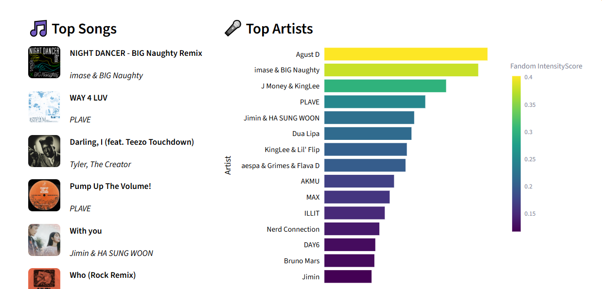
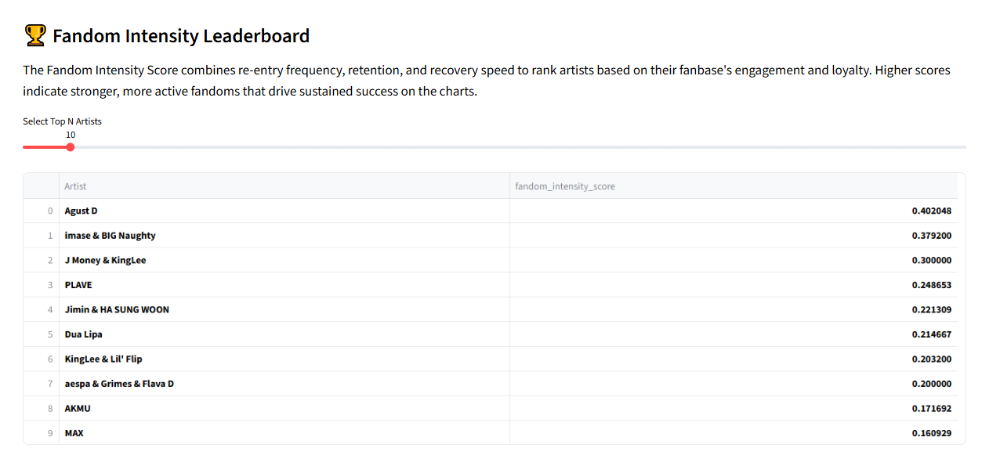
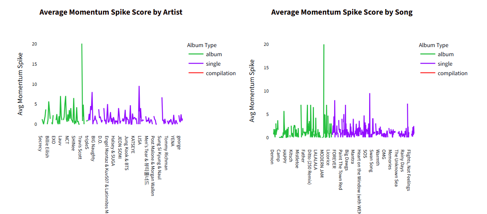
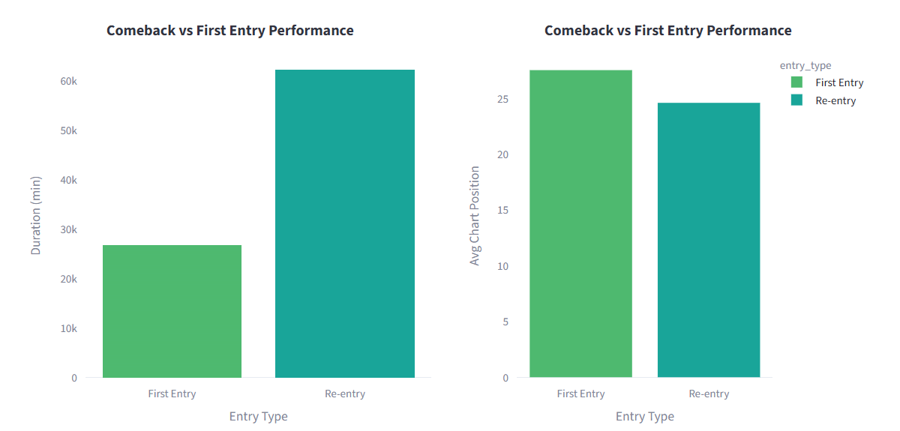

# 🎧 Comeback Momentum, Chart Re-Entry, and Fandom Intensity Analysis of South KoreaTop 50 Playlist
### Comeback Momentum & Retention Analytics

An interactive Streamlit dashboard that analyzes K-Pop chart performance, fandom loyalty, and comeback success using chart data. The dashboard introduces custom analytics metrics to measure artist momentum, fan engagement, retention, and chart re-entry behavior.

---

## 📖 Project Overview

K-Pop success is driven not only by chart rankings but also by fan engagement and comeback performance. This project explores how artists maintain popularity over time by analyzing chart re-entries, recovery speed, retention, and fandom intensity.

The dashboard transforms raw chart data into actionable insights through interactive visualizations, custom KPIs, and advanced analytical metrics.

---

## 🎯 Objectives

- Measure fandom engagement and loyalty
- Analyze comeback effectiveness
- Identify high-performing artists and songs
- Compare album and single release strategies
- Evaluate chart retention and recovery behavior
- Discover patterns behind successful chart re-entries

---

## 📊 Key Metrics

### 🔁 Re-entry Frequency
Measures how often a song returns to the charts after disappearing.

### ⚡ Momentum Spike Score
Tracks sudden improvements in chart rankings and comeback impact.

### 📈 Recovery Speed
Measures how quickly a song recovers chart positions after re-entering.

### 📊 Retention Analysis
Evaluates how long songs remain active on the charts.

### 💿 Album Comeback Advantage Index (ACAI)
Compares recovery performance between album releases and singles.

### 🔥 Fandom Intensity Score
A composite metric based on:

- Re-entry Frequency
- Retention Strength
- Recovery Speed

Used to quantify overall fandom engagement and loyalty.

---

## 🚀 Dashboard Features

### 📌 Overview
- Top Songs Ranking
- Top Artists Ranking
- KPI Cards
- Fandom Performance Insights

### 🏆 Fandom Intensity Leaderboard
- Artist ranking based on fandom intensity
- Dynamic Top-N selection

### 📈 Momentum Spike Analysis
- Artist Momentum Trends
- Song Momentum Trends
- Album vs Single Comparison
- Duration vs Momentum Analysis

### 🔁 Re-entry Status
- Fandom Reactivation Analysis
- Comeback vs First Entry Comparison
- Re-entry Performance Tracking

### 📊 Retention Analysis
- Average Retention by Artist
- Chart Longevity Evaluation

### 📂 Dataset Explorer
- Search Songs and Artists
- Interactive Data Table
- CSV Export Functionality


## 📁 Project Structure

```bash
├── dashboard.py
├── Atlantic_South_Korea.csv
├── logo.png
├── tbt_coverkpop_header.jpg
├── requirements.txt
└── README.md
```

---

## 📷 Dashboard Preview

### Overview Dashboard


### Fandom Intensity Leaderboard


### Momentum Spike Analysis


### Re-entry Status Analysis


---

## 🔍 Business Insights Generated

The dashboard helps identify:

- Artists with the strongest fandom loyalty
- Songs generating the highest comeback momentum
- Most effective release strategies
- Long-term chart retention patterns
- Fan-driven chart reactivation behavior
- Recovery trends after chart decline

---


## 📈 Future Improvements

- Machine Learning-based chart prediction
- Sentiment analysis from social media
- Spotify API integration
- Artist popularity forecasting
- Advanced fan engagement analytics

---

## 👨‍💻 Author

**Subhradip Sahoo**

- Data Analyst
- Power BI Developer
- Python Developer

### Skills
- Data Analytics
- Business Intelligence
- Dashboard Development
- Data Visualization
- Statistical Analysis

---

⭐ If you found this project useful, consider giving it a star on GitHub.
